# Building Cohort App Walkthrough
Let's go through an example that everyone can follow, regardless of the data you store in your databases. We will create a cohort that contains emails and names of users that don't have multi-factor authentication enabled.

_[main docs](cohort_builder_docs.md)_

## Home Screen
First, after opening the app, you will be prompted to give it permissions grant all the necessary privileges: 

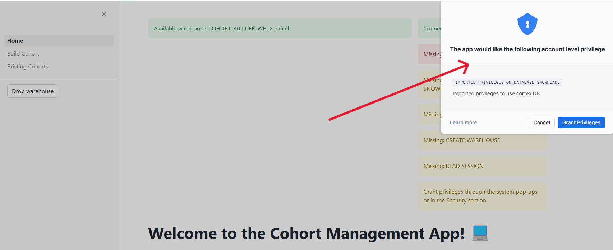


After that, we must create a warehouse to process our cohort. I am leaving default settings here, but feel free to adjust them to your needs:

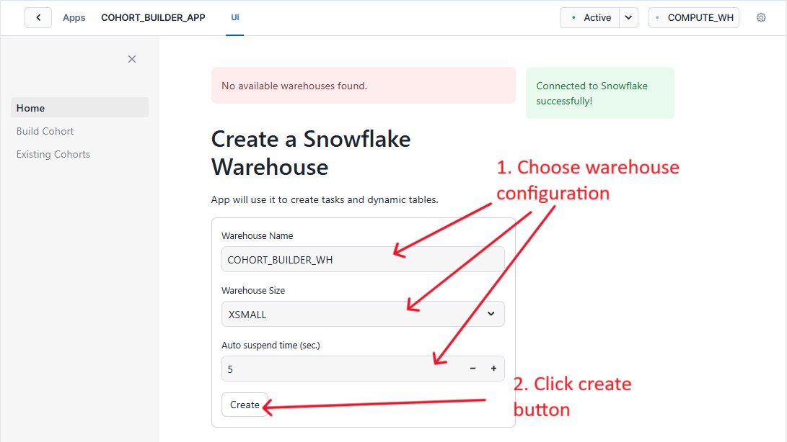


We also need to give our app privileges to query the table that will be the base of our cohort. For our purpose, that table is SNOWFLAKE.ACCOUNT_USAGE.USERS. This table is in a shared database, so granting privileges differs slightly from the standard path. We want to execute this query in a worksheet:

```sql
GRANT IMPORTED PRIVILEGES ON DATABASE SNOWFLAKE TO APPLICATION COHORT_BUILDER_APP;
```

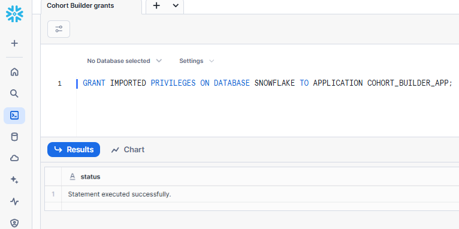


## Build Cohort
### Select Dataset
The First Section of the "Build Cohort" section is "Select Dataset". We are selecting here the table that we want to use:

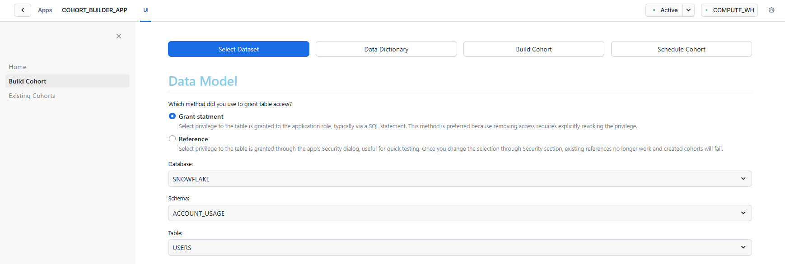


Note: You can see a session indicator in the right corner of your screen. Don't click buttons if it's spinning like this:

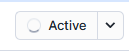


### Data Dictionary
As stated before, I want to get a table with a list of users that don't have multi-factor authentication enabled, so I am including the HAS_MFA column in my filter selection with a boolean filter Filter Type (this filter type is best for the Boolean data type). I also want to exclude service users from this list, so I also include the TYPE column with text filter Filter Type: 

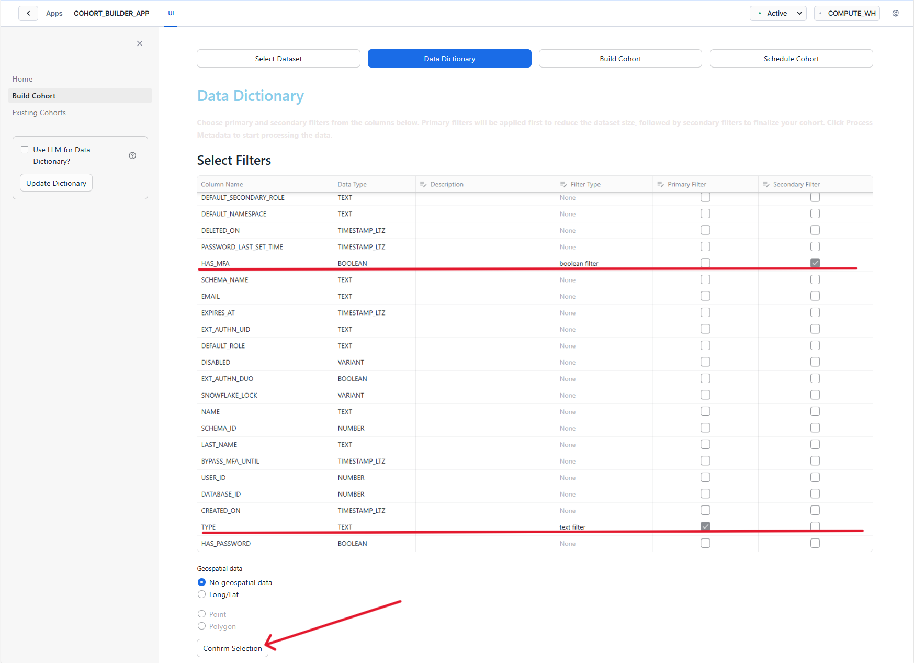

Then we click the "Confirm Selection" button, and after the data is processed, we go to the next section – "Build Cohort."


### Build Cohort
Here, we have first to choose text filter conditions, submit them, and then Apply Primary Filters:

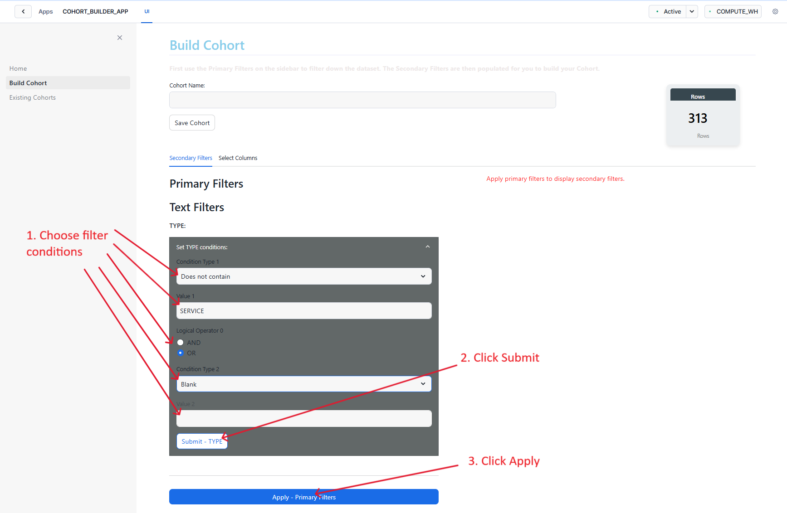


After that, the Secondary Filters section will appear. I want to include users that don't MFA, so I am leaving the checkbox empty and clicking Apply Secondary Filters:

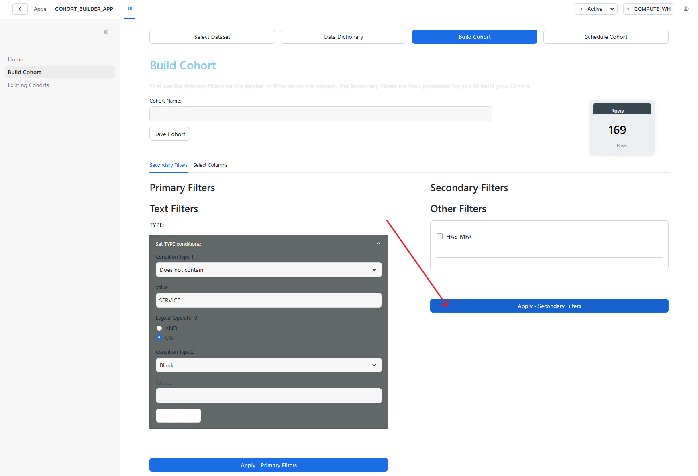


Now, since the USERS table has a lot of different columns that I don't need, I go to the "Select Columns" section to choose only those that I will use from the dropdown and confirm my choice with the "Select Columns" button:

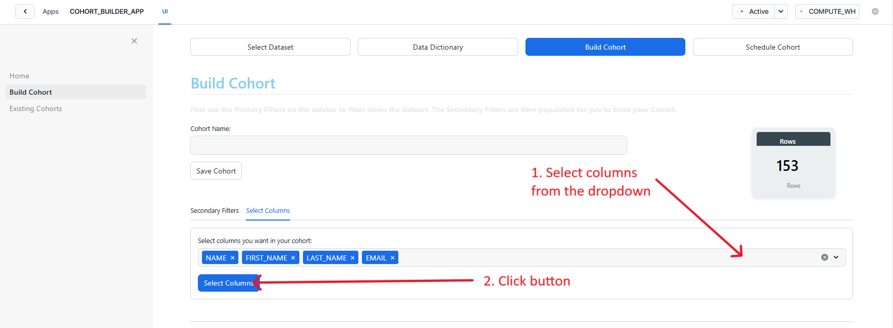


After that, we need to give our cohort a name and save it:

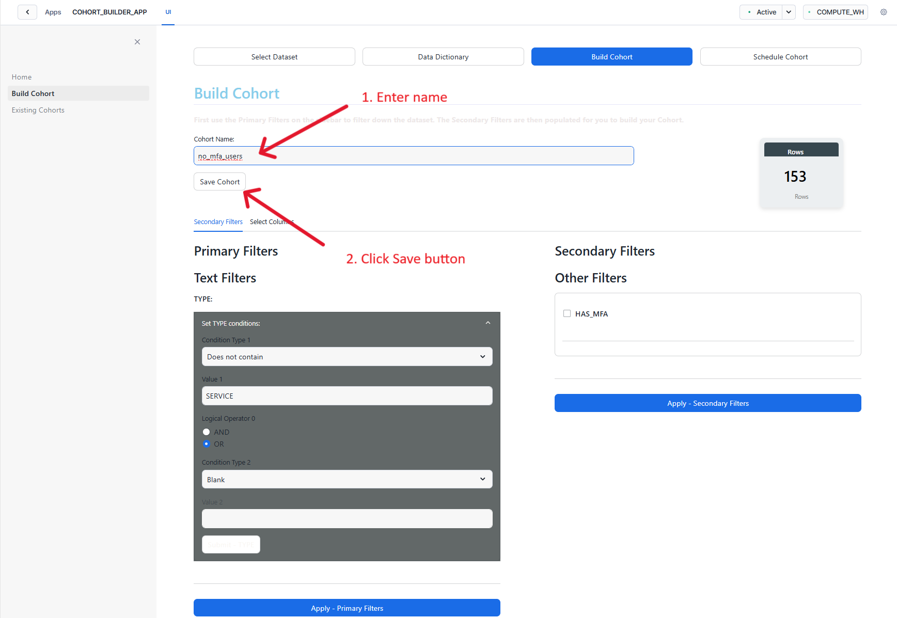


Now your cohort configuration is saved in COHORT_BUILDER_APP.COHORTS.SAVED_COHORTS_SETTINGS table:

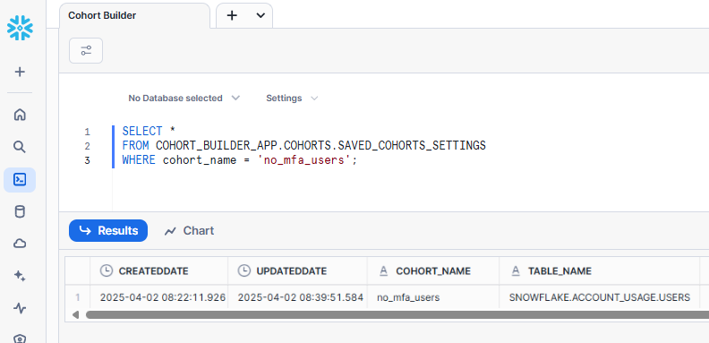


### Schedule Cohort
In the previous step, we created just the configuration. To create a table with the data we need, let's go to the "Schedule Cohort" section. Here, we will select a Snapshot table, as we want to monitor how many users are enabling their MFA each week; then, we will choose a weekly cadence and name my table:

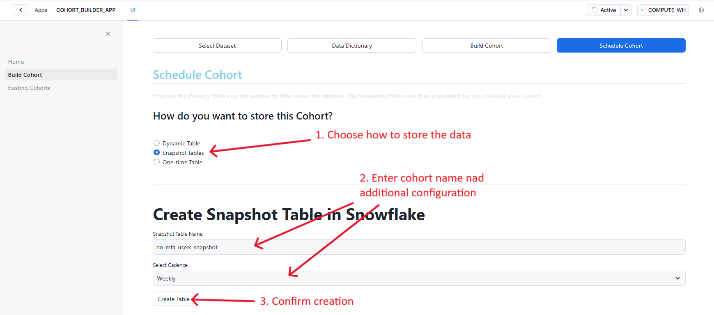


That's it! Now, our snapshot table is created in the app database, as well as the task and procedure to produce a new table each week: 

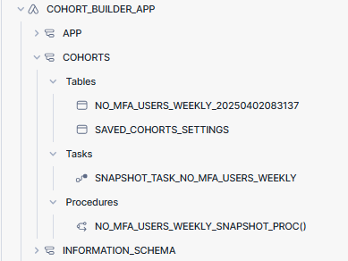


---

Happy cohorting!

_[return to main docs](cohort_builder_docs.md)_